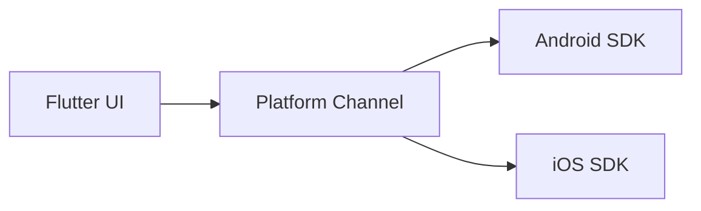

When your product needs advanced streaming features — adaptive bitrate, DRM, or custom player controls — you may need a native SDK instead of a generic Flutter video package. This post covers integrating the Alibaba Video Player SDK through platform channels.

## When to use a native SDK

Flutter packages like `video_player` work for many cases, but enterprise streaming platforms often require vendor SDKs for licensing, analytics, and playback reliability across devices.

## Architecture overview

The integration typically follows this pattern:

1. Wrap the native Alibaba SDK on Android and iOS.
2. Expose a thin platform channel API to Dart.
3. Build a Flutter widget that renders the native player view.



## Android setup

Add the Alibaba SDK dependency in `android/app/build.gradle`, configure required permissions in `AndroidManifest.xml`, and initialize the SDK in your `MainActivity` or a dedicated plugin class.

## iOS setup

Use CocoaPods to install the iOS SDK, update `Info.plist` for network and background playback permissions, and register the native view factory.

## Dart interface

Expose only the methods your app needs — play, pause, seek, set source URL, and dispose:

```dart
class AlibabaVideoPlayer {
  static const _channel = MethodChannel('alibaba_video_player');

  Future<void> play(String url) =>
      _channel.invokeMethod('play', {'url': url});

  Future<void> pause() => _channel.invokeMethod('pause');

  Future<void> dispose() => _channel.invokeMethod('dispose');
}
```

## Common pitfalls

- Mismatched SDK versions between Android and iOS builds.
- Forgetting to release native player resources on widget dispose.
- Testing only on emulators — real-device playback behavior can differ significantly.

## Conclusion

Platform channel integrations take more effort than pub.dev packages, but they unlock vendor-specific capabilities. Keep the Dart API small, test on real devices early, and document SDK version requirements for your team.
